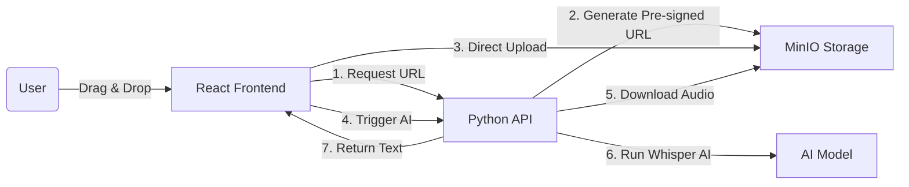

```markdown
# 🎙️ VoiceSync AI

> **A Secure, Offline Audio Transcription Platform.**
> *Built with React, Python (FastAPI), MinIO, and OpenAI Whisper.*


*(Replace with a screenshot of your React App)*

## 🏗️ Architecture

Unlike typical AI apps that send data to the cloud, **VoiceSync runs entirely locally**.



## 🛠️ Tech Stack

*   **Frontend:** React (Vite), TypeScript, Tailwind CSS, Axios.
*   **Backend:** Python 3.11, FastAPI, Uvicorn.
*   **AI Engine:** Faster-Whisper (OpenAI's model optimized for CPU).
*   **Storage:** MinIO (Docker) - S3 Compatible Object Storage.
*   **Tools:** FFmpeg (Audio Processing).

## 🚀 Installation & Setup

### 1. Prerequisites
*   Docker Desktop (Running)
*   Node.js v18+
*   Python 3.10+
*   **FFmpeg** (Required for Audio):
    *   *Windows:* `winget install Gyan.FFmpeg`

### 2. Start Infrastructure (The Storage)
```bash
docker-compose up -d
# Runs MinIO on Port 9090 (API) and 9001 (Console)
```

### 3. Start Backend (The Brain)
```bash
cd ai-engine

# Create Virtual Environment
python -m venv .venv

# Activate (Windows)
.\.venv\Scripts\activate

# Install Dependencies
pip install -r requirements.txt

# Run Server
uvicorn main:app --reload
# Runs on http://localhost:8000
```

### 4. Start Frontend (The Interface)
```bash
cd web-client
npm install
npm run dev
# Runs on http://localhost:5173
```

## 🧪 Usage Guide
1.  Open **http://localhost:5173**.
2.  Drag and drop an MP3/WAV file.
3.  Watch the status change: `Uploading` → `AI Processing` → `Done`.
4.  Copy the transcribed text.

## 🛡️ Security Features
*   **Pre-Signed URLs:** The backend generates a temporary, secure link for uploads. Large files never touch the Python server directly.
*   **Offline Privacy:** No audio data is sent to OpenAI, Google, or AWS. Everything stays on your machine.

---
*Engineered by Harshan Aiyappa.*
```