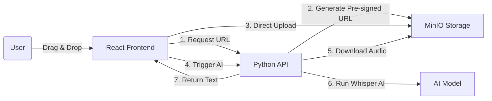

# VoiceSync AI
## Secure Offline Audio Transcription Platform

<div align="center">


**Tech Stack**


**Features**


</div>

---

## Visual Overview

### Upload Interface

<p align="center">
  
</p>

*Drag-and-drop audio upload with real-time processing status*

### Transcription Results

<p align="center">
  
</p>

*Clean transcription output with metadata and download options*

---

## Overview

**VoiceSync AI** is a secure, offline audio transcription platform built with React, Python (FastAPI), MinIO, and OpenAI Whisper. Unlike typical AI apps that send data to the cloud, **VoiceSync runs entirely locally**.

### Key Differentiator

**100% Local Processing**: No audio data is sent to OpenAI, Google, or AWS. Everything stays on your machine.

### Features

- **Secure Upload**: Pre-signed URLs for direct client-to-storage upload (large files never touch the Python server)
- **Offline Privacy**: Whisper AI model runs locally on your CPU
- **Fast Processing**: Faster-Whisper optimization for CPU inference
- **Modern UI**: React + Vite + Tailwind CSS with drag-and-drop interface
- **S3-Compatible Storage**: MinIO for scalable object storage

---

## Architecture



---

## Tech Stack

- **Frontend**: React (Vite), TypeScript, Tailwind CSS, Axios
- **Backend**: Python 3.11, FastAPI, Uvicorn
- **AI Engine**: Faster-Whisper (OpenAI's model optimized for CPU)
- **Storage**: MinIO (Docker) - S3 Compatible Object Storage
- **Tools**: FFmpeg (Audio Processing)

---

## Installation & Setup

### 1. Prerequisites
- Docker Desktop (Running)
- Node.js v18+
- Python 3.10+
- **FFmpeg** (Required for Audio):
  - *Windows:* `winget install Gyan.FFmpeg`

### 2. Start Infrastructure
```bash
docker-compose up -d
# Runs MinIO on Port 9090 (API) and 9001 (Console)
```

### 3. Start Backend
```bash
cd ai-engine

# Create Virtual Environment
python -m venv .venv

# Activate (Windows)
.\.venv\Scripts\activate

# Install Dependencies
pip install -r requirements.txt

# Run Server
uvicorn main:app --reload
# Runs on http://localhost:8000
```

### 4. Start Frontend
```bash
cd web-client
npm install
npm run dev
# Runs on http://localhost:5173
```

---

## Usage Guide

1. Open **http://localhost:5173**
2. Drag and drop an MP3/WAV file
3. Watch the status change: `Uploading` → `AI Processing` → `Done`
4. Copy the transcribed text

---

## Security Features

### Pre-Signed URLs
The backend generates a temporary, secure link for uploads. Large files never touch the Python server directly - they go straight to MinIO storage.

### Offline Privacy
No audio data is sent to external services. The Whisper AI model runs locally on your machine, ensuring complete privacy.

---

## License

MIT License

---

**Built by**: [Harshan Aiyappa](https://github.com/Kimosabey)  
**Tech Stack**: React • Python • FastAPI • Whisper AI • MinIO  
**Focus**: Privacy • Offline Processing • Secure Transcription