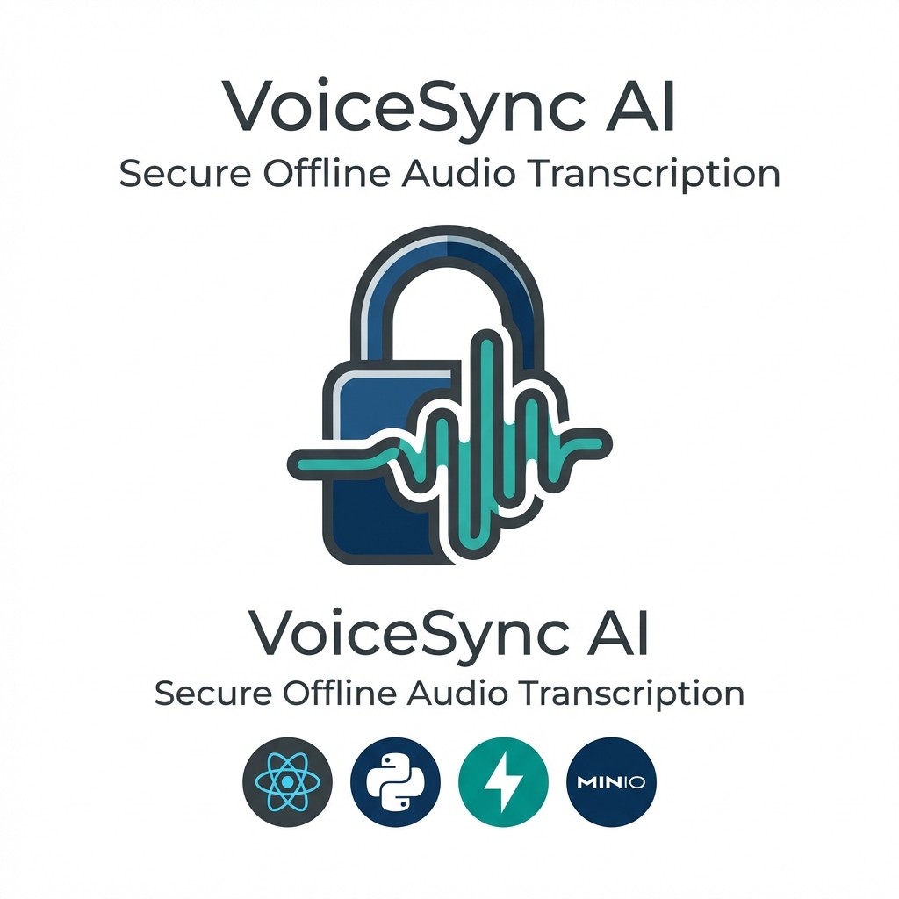
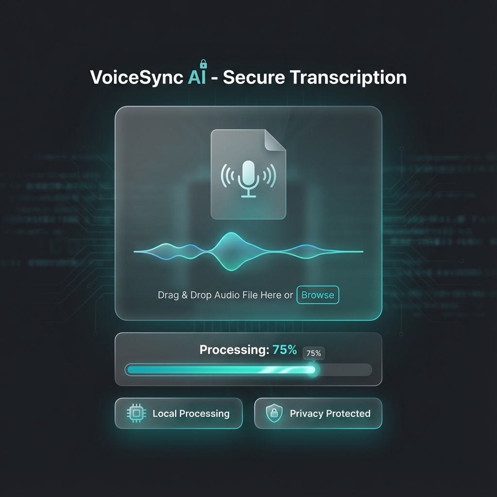
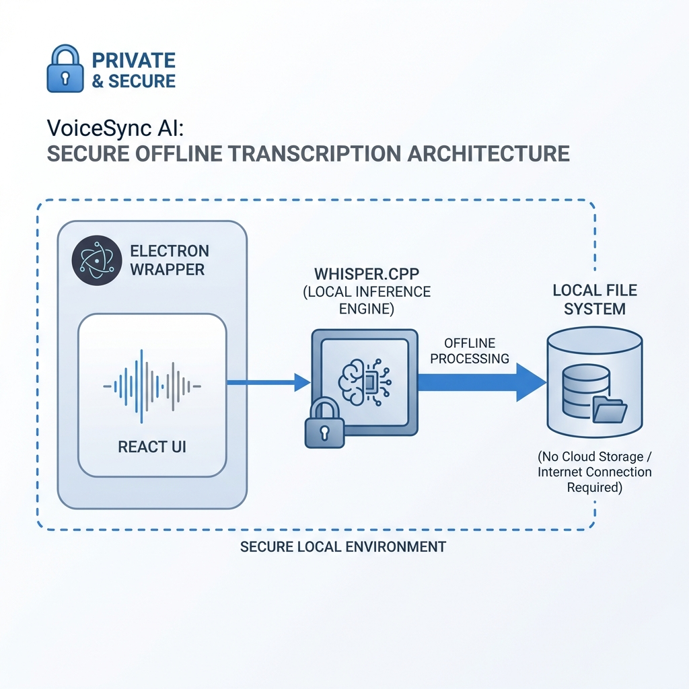

# VoiceSync AI



## Secure Offline Audio Transcription Platform

<div align="center">


**Tech Stack**


**Features**


</div>

---

## 🚀 Quick Start

### 1. Prerequisites
- Docker Desktop (Running)
- Node.js v18+ & Python 3.10+
- **FFmpeg** (Required)

### 2. Start Infrastructure
```bash
docker-compose up -d
# Runs MinIO on Port 9090 (API) and 9001 (Console)
```

### 3. Start Backend
```bash
cd ai-engine
python -m venv .venv
.\.venv\Scripts\activate   # or source .venv/bin/activate
pip install -r requirements.txt
uvicorn main:app --reload
# Runs on http://localhost:8000
```

### 4. Start Frontend
```bash
cd web-client
npm install
npm run dev
# Runs on http://localhost:5173
```

---

## 📸 Screenshots

### Upload Interface

*Drag-and-drop audio upload with real-time processing status*

### Transcription Results

*Clean transcription output with metadata and download options*

---

## ✨ Key Features

### 🔒 100% Offline Privacy
- **Local Inference**: Whisper AI model runs entirely on your CPU.
- **No Cloud Data**: Zero audio data is sent to OpenAI, Google, or AWS.

### 🛡️ Secure Architecture
- **Pre-signed URLs**: Direct client-to-storage upload prevents server bottlenecks.
- **S3-Compatible**: Uses MinIO for scalable, standardized object storage.

### ⚡ Optimized Performance
- **Faster-Whisper**: Optimized implementation for faster CPU inference.
- **Modern UI**: React + Vite + Tailwind CSS for a snappy experience.

---

## 🏗️ Architecture



### Data Flow
1. **User** drops file → Frontend requests upload URL.
2. **Backend** generates secure pre-signed URL.
3. **Frontend** uploads **directly** to MinIO (bypassing backend upload limits).
4. **Backend** downloads from MinIO, runs Whisper, returns text.

---

## 🔧 Tech Stack

| Component | Technology | Purpose |
| :--- | :--- | :--- |
| **Frontend** | React (Vite) | Modern SPA Dashboard |
| **Backend** | Python FastAPI | Async API & Orchestration |
| **AI Engine** | Faster-Whisper | Optimized CPU Inference |
| **Storage** | MinIO (Docker) | S3-Compatible Object Store |
| **Processing** | FFmpeg | Audio/Video handling |

---

## 🧪 Testing & Usage

1. Open **http://localhost:5173**
2. Drag and drop an MP3/WAV file
3. Watch the status change: `Uploading` → `AI Processing` → `Done`
4. Copy the transcribed text

---

## 📝 License

MIT License - See [LICENSE](./LICENSE) for details

---

## 👤 Author

**Harshan Aiyappa**  
Senior Full-Stack Engineer  
📧 [GitHub](https://github.com/Kimosabey)

---

**Built with**: React • Python • FastAPI • Whisper AI • MinIO  
**Focus**: Privacy • Offline Processing • Secure Transcription
