# 🏗️ System Architecture

## 1. High-Level Design (HLD)

The system architecture prioritizes **Data Privacy** and **Upload Efficiency**. By using a **Pre-Signed URL** pattern, we bypass the backend server for file uploads, preventing bandwidth bottlenecks and ensuring the AI engine remains dedicated to inference.

```mermaid
graph TD
    %% Nodes
    User(("👤 User"))
    UI("💻 React Frontend")
    Auth("🔑 FastAPI (Auth/Orchestration)")
    Storage[("📦 MinIO (Object Store)")]
    AI("🧠 Whisper Engine")

    %% Flows
    User -->|"1. Drop File"| UI
    UI -->|"2. Request Upload URL"| Auth
    Auth -->|"3. Generate Pre-Signed URL"| Storage
    Storage -.->|"4. URL + Token"| Auth
    Auth -.->|"5. Secure URL"| UI
    UI -->|"6. Direct Upload (PUT)"| Storage
    
    UI -->|"7. Trigger Transcribe"| Auth
    Auth -->|"8. Fetch Audio"| Storage
    Auth -->|"9. Run Inference"| AI
    AI -.->|"10. Return Text"| Auth
    Auth -.->|"11. JSON Result"| UI

    %% Styling
    style User fill:#f9f,stroke:#333
    style Storage fill:#ff9,stroke:#333
    style AI fill:#9f9,stroke:#333
```

### Core Components
1.  **Orchestrator (FastAPI)**: Manages authentication and coordinates the workflow. It does *not* handle heavy file streams from the client.
2.  **Object Store (MinIO)**: S3-Compatible storage. Holds temporary audio files. This is the "Safe" where data rests.
3.  **Inference Engine (Faster-Whisper)**: Run locally on CPU/GPU. Optimized for speed (`int8` quantization).
4.  **Frontend (React/Vite)**: Modern interface that handles the direct-to-S3 upload logic.

---

## 2. Low-Level Design (LLD)

### API Contracts

**POST `/api/upload-url`**
*   **Request**: `{ filename: "meeting.mp3", size: 10485760 }`
*   **Response**: `{ uploadUrl: "http://minio:9000/bucket/meeting.mp3?token=...", fileId: "uuid" }`
*   **Purpose**: Grants temporary permission to write to storage.

**POST `/api/transcribe`**
*   **Request**: `{ fileId: "uuid", language: "en" }`
*   **Response**: `{ text: "Hello world...", segments: [...] }`
*   **Purpose**: Triggers the heavy compute task.

---

## 3. Decision Log

| Decision | Alternative | Reason for Choice |
| :--- | :--- | :--- |
| **MinIO (S3)** | Local Filesystem | **Scalability & Standard**. Using S3 APIs means this app can be deployed to AWS/GCP with *zero code changes*. |
| **Faster-Whisper** | OpenAI API | **Privacy**. The strict requirement was "No Data Leaves the Device". Faster-Whisper runs locally. |
| **Pre-Signed URLs** | Multipart Upload | **Performance**. Multipart upload ties up the API server (Python) to transfer bytes. Pre-signed URLs offload network I/O to the Storage layer. |
| **FastAPI** | Flask/Django | **Async Support**. FastAPI's async nature allows handling concurrent transcription requests efficiently. |

---

## 4. Key Patterns

### The "Sidecar Upload" Pattern
Instead of passing the file *through* the application server (Client -> App -> Storage), we utilize the "Sidecar" path (Client -> Storage). The App server only acts as a control plane, authorizing the transfer. This allows the backend to remain lightweight even when users are uploading 1GB+ video files.
